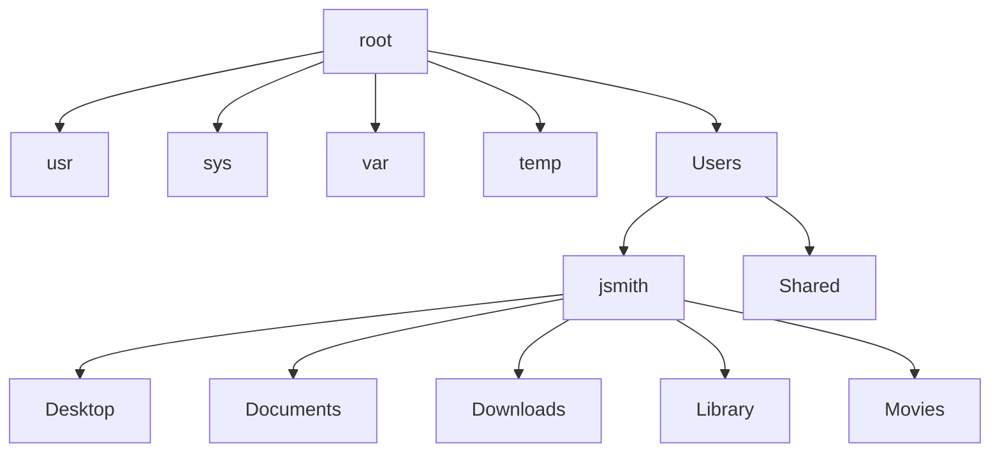

Crash course: UNIX Essentials

---

## Introduction to the UNIX Operating System

**By the end of this module you should be able to**

1. Identify the three major parts of the Unix Operating System
  
2. Explain how the Unix directory is structured
  
3. Demonstrate how to navigate the files and directory system using the Unix Shell
  

**Due to limited class time I have summarized the most important materials from these sources. On your own time, I highly recommend you read through the following tutorials**

- [Duke University Department of Computer Science](https://users.cs.duke.edu/~alvy/courses/unixtut/unixintro.html)
  
- [University of Georgia](https://wiki.gacrc.uga.edu/wiki/Training)
  
- [Software Carpentries](https://swcarpentry.github.io/shell-novice/index.html)
  

---

Download files

You need to download some files to follow this lesson.

1. Download [shell-lesson-data.zip](https://swcarpentry.github.io/shell-novice/data/shell-lesson-data.zip) and move the file to your Desktop.
2. Unzip/extract the file. **Let your instructor know if you need help with this step**. You should end up with a new folder called **`shell-lesson-data`** on your Desktop.

---

The UNIX Operating System was first developed in the 1960's and has been under constant development since then. There are many different versions of UNIX; however, the most popular varieties of UNIX are Linux and MacOS. Regardless of which version of UNIX you are using the operating system has the same three major components: the 1) Kernel, 2) Shell, 2) Programs.

## The Kernel

The kernel of UNIX is the hub of the operating system: it is the system that allocates time and memory to programs and handles the filestore and communications in response to system calls. 

## The Shell

The shell acts as an interface between the user and the kernel. When a user logs in, the login program checks the username and password, and then starts another program called the shell. The shell is a command line interpreter (CLI). It interprets the commands the user types in and arranges for them to be carried out. The commands are themselves programs: when they terminate, the shell gives the user another prompt (username@machinename> on our systems, but in this tutorial you will see % as the prompt in many examples...Do Not be Alarmed by this difference).

## Directory Structure

All files on your computer are organized heirarchly in a directory structure. At the top of the hierarchy is the "root" usually written as `/`. Personal directories are written in the `Users` folder. Many programs are written in `Bin` . The written locations are referred to as paths. The **absolute path** includes the entire path starting from the root directory while the **relative path** starts from a specific location. The paths can be thought of GPS directions with the. The aboslute path is the directions starting from your permanent residence, such as your house. But if need directions while you are bowling with your friend, you might require the relative path.

In the example below the aboslute path to the user *jsmith* directory is `/Users/jsmith/` Notice how the "root" is not written in the path - instead the front slash is used to indicate the root directory.



## Navigating files and directories

In order to orient yourself, you should first know where you are located in your computer. In order to **p**rint the **w**orking **d**irectory you can use the following command.

```bash
$ pwd
```

```bash
/Users/jsmith
```

You can **l**i**s**t the files and folders in your current working directory using the following command.

```bash
$ ls
```

```bash
Desktop    Downloads    Library    Pictures
Documents  Movies       Music      Public    
```

So far we know there are eight different folders or files in the directory. If we would like to classify the output we can use the flag `-F`

```bash
$ ls -F 
```

```bash
Desktop/    Downloads/    Library/    Pictures/
Documents/  Movies/       Music/      Public/    
```

The character after the output indicates what they are,

- a trailing `/` indicates that this is a directory
- `@` indicates a link
- `*` indicates an executable

In this case all the objects in the directory `/Users/jsmith/` are folders or subdirectories.

If you would like to navigate to a different directory you can use the **c**hange **d**irectories command

```bash
$ cd Desktop 
```

In this example, you only changed directories and DO NOT have an message outputed to your terminal. You can use the `pwd` command to print you new working directory.

```bash
$ pwd
```

```bash
/Users/jsmith/Desktop
```

If you would like to go back to your user directory you can either use the absolute path:

```bash
$ cd /Users/jsmith
```

or use a relative path:

```bash
$ cd ../
```

the `../` indicate the directory above the current directory.

## Accessing help menus or manuals

If you forget how to use a commnad there are several ways to pull up a help menu or the program's **man**ual.

```bash
$ man ls
```

## Syntax of a Shell Command


In the example above, `ls` is the **command**, with an **option** (aka flag) `-F` and an **argument** `/`. There are two ways to implement an option: using a short option with a single dash (`-`) or a long option (`--`). The argument tells the command what you want it to operate on whether it is a file or a directory. Together the options and arguments are referred to as **parameters**. A command can be called with more than one option and more than one argument, but a command doesn’t always require an argument or an option.

## Creating directories

### Step one: see where we are and what we already have

We should still be in the `shell-lesson-data` directory on the Desktop,
which we can check using:

```bash
$ pwd
```

```output
/Users/jmith/Desktop/shell-lesson-data
```

Next we'll move to the `exercise-data/writing` directory and see what it contains:

```bash
$ cd exercise-data/writing/
$ ls -F
```

```output
haiku.txt  LittleWomen.txt
```

### Create a directory

Let's create a new directory called `thesis` using the command `mkdir thesis` (which has no output):

```bash
$ mkdir thesis
```

As you might guess from its name, `mkdir` means 'make directory'.
Since `thesis` is a relative path
(i.e., does not have a leading slash, like `/what/ever/thesis`),
the new directory is created in the current working directory:

```bash
$ ls -F
```

```output
haiku.txt  LittleWomen.txt  thesis/
```

Since we've just created the `thesis` directory, there's nothing in it yet:

```bash
$ ls -F thesis
```

Note that `mkdir` is not limited to creating single directories one at a time.
The `-p` option allows `mkdir` to create a directory with nested subdirectories
in a single operation:

```bash
$ mkdir -p ../project/data ../project/results
```

The `-R` option to the `ls` command will list all nested subdirectories within a directory.
Let's use `ls -FR` to recursively list the new directory hierarchy we just created in the `project` directory:

```bash
$ ls -FR ../project
```

```output
../project/:
data/  results/

../project/data:
../project/results:
```

## Good names for files and directories

Complicated names of files and directories can make your life painful when working on the command line. Here we provide a few useful tips for the names of your files and directories.

Don't use spaces.

1. Spaces can make a name more meaningful, but since spaces are used to separate arguments on the command line it is better to avoid them in names of files and directories. You can use `-` or `_` instead (e.g. `north-pacific-gyre/` rather than `north pacific gyre/)`.
  
2. Don't begin the name with `-` (dash). Commands treat names starting with `-` as options.
  
3. Stick with letters, numbers, `.` (period or 'full stop'), `-` (dash) and `_` (underscore).
  

## Shell Text Editors

On Unix systems (such as Linux and macOS), many programmers use [Emacs](https://www.gnu.org/software/emacs/) or [Vim](https://www.vim.org/) (both of which require more time to learn), or a graphical editor such as [Gedit](https://projects.gnome.org/gedit/) or [VScode](https://code.visualstudio.com/). On Windows, you may wish to
use [Notepad++](https://notepad-plus-plus.org/). Windows also has a built-in editor called `notepad` that can be run from the command line in the same way as `nano` for the purposes of this lesson. No matter what editor you use, you will need to know where it searches for and saves files. If you start it from the shell, it will (probably) use your current working directory as its default location. If you use your computer's start menu, it may want to save files in your Desktop or Documents directory instead.

## Create a text file

Let's change our working directory to `thesis` using `cd`,
then run a text editor called Nano to create a file called `draft.txt`:

```bash
$ cd thesis
$ nano draft.txt
```

## Creating Files a Different Way

We have seen how to create text files using the `nano` editor.
Now, try the following command:

```bash
$ touch my_file.txt
```


Once we’re happy with our text, we can press Ctrl+O (press the Ctrl or Control key and, while holding it down, press the O key) to write our data to disk. We will be asked to provide a name for the file that will contain our text. Press Return to accept the suggested default of `draft.txt`.

Once our file is saved, we can use Ctrl+X to quit the editor and return to the shell.

Returning to the `shell-lesson-data/exercise-data/writing` directory,

```bash
$ cd ~/Desktop/shell-lesson-data/exercise-data/writing
```

In our `thesis` directory we have a file `draft.txt`which isn't a particularly informative name, so let's change the file's name using `mv`, which is short for 'move':

```bash
$ mv thesis/draft.txt thesis/quotes.txt
```

The first argument tells `mv` what we're 'moving', while the second is where it's to go.
In this case, we're moving `thesis/draft.txt` to `thesis/quotes.txt`,
which has the same effect as renaming the file. Sure enough, `ls` shows us that `thesis` now contains one file called `quotes.txt`:

```bash
$ ls thesis
```

```output
quotes.txt
```

One must be careful when specifying the target file name, since `mv` will silently overwrite any existing file with the same name, which could lead to data loss. By default, `mv` will not ask for confirmation before overwriting files.

## Copying files and directories

The `cp` command works very much like `mv`, except it copies a file instead of moving it. We can check that it did the right thing using `ls` with two paths as arguments --- like most Unix commands,`ls` can be given multiple paths at once:

```bash
$ cp quotes.txt thesis/quotations.txt
$ ls ./ thesis/
```

```output
quotes.txt   thesis/quotations.txt
```

We can also copy a directory and all its contents by using the [recursive](https://en.wikipedia.org/wiki/Recursion) option `-r`, e.g. to back up a directory:

```bash
$ cp -r thesis thesis_backup
```

We can check the result by listing the contents of both the `thesis` and `thesis_backup` directory:

```bash
$ ls thesis thesis_backup
```

```output
thesis:
quotations.txt
thesis_backup:
quotations.txt
```

It is important to include the `-r` flag. If you want to copy a directory and you omit this option
you will see a message that the directory has been omitted because `-r not specified`.

```bash
$ cp thesis thesis_backup
cp: -r not specified; omitting directory 'thesis'
```

## Removing files and directories

Returning to the `shell-lesson-data/exercise-data/writing` directory, let's tidy up this directory by removing the `quotes.txt` file we created. The Unix command we'll use for this is `rm` (short for 'remove'):

```bash
$ rm quotes.txt
```

We can confirm the file has gone using `ls`:

```bash
$ ls quotes.txt
```

```error
ls: cannot access 'quotes.txt': No such file or directory
```

## Deleting Is Forever

**The Unix shell doesn't have a trash bin that we can recover deleted files from (though most graphical interfaces to Unix do). Instead, when we delete files, they are unlinked from the file system so that their storage space on disk can be recycled. Tools for finding and recovering deleted files do exist, but there's no guarantee they'll work in any particular situation, since the computer may recycle the file's disk space right away.**

Download files

You need to download some files to follow this lesson.

1. Download [shell-lesson-data.zip](https://swcarpentry.github.io/shell-novice/data/shell-lesson-data.zip) and move the file to your Desktop.
2. Unzip/extract the file. **Let your instructor know if you need help with this step**. You should end up with a new folder called **`shell-lesson-data`** on your Desktop.

---

## Creating directories

### Step one: see where we are and what we already have

We should still be in the `shell-lesson-data` directory on the Desktop,
which we can check using:

```bash
$ pwd
```

```output
/Users/nelle/Desktop/shell-lesson-data
```

Next we'll move to the `exercise-data/writing` directory and see what it contains:

```bash
$ cd exercise-data/writing/
$ ls -F
```

```output
haiku.txt  LittleWomen.txt
```

### Create a directory

Let's create a new directory called `thesis` using the command `mkdir thesis`
(which has no output):

```bash
$ mkdir thesis
```

As you might guess from its name,
`mkdir` means 'make directory'.
Since `thesis` is a relative path
(i.e., does not have a leading slash, like `/what/ever/thesis`),
the new directory is created in the current working directory:

```bash
$ ls -F
```

```output
haiku.txt  LittleWomen.txt  thesis/
```

Since we've just created the `thesis` directory, there's nothing in it yet:

```bash
$ ls -F thesis
```

Note that `mkdir` is not limited to creating single directories one at a time.
The `-p` option allows `mkdir` to create a directory with nested subdirectories
in a single operation:

```bash
$ mkdir -p ../project/data ../project/results
```

The `-R` option to the `ls` command will list all nested subdirectories within a directory.
Let's use `ls -FR` to recursively list the new directory hierarchy we just created in the
`project` directory:

```bash
$ ls -FR ../project
```

```output
../project/:
data/  results/

../project/data:
../project/results:
```

## Good names for files and directories

Complicated names of files and directories can make your life painful when working on the command line. Here we provide a few useful tips for the names of your files and directories.

Don't use spaces.

1. Spaces can make a name more meaningful, but since spaces are used to separate arguments on the command line it is better to avoid them in names of files and directories. You can use `-` or `_` instead (e.g. `north-pacific-gyre/` rather than `north pacific gyre/)`.
  
2. Don't begin the name with `-` (dash). Commands treat names starting with `-` as options.
  
3. Stick with letters, numbers, `.` (period or 'full stop'), `-` (dash) and `_` (underscore).
  

## Shell Text Editors

On Unix systems (such as Linux and macOS), many programmers use [Emacs](https://www.gnu.org/software/emacs/) or [Vim](https://www.vim.org/) (both of which require more time to learn), or a graphical editor such as [Gedit](https://projects.gnome.org/gedit/) or [VScode](https://code.visualstudio.com/). On Windows, you may wish to
use [Notepad++](https://notepad-plus-plus.org/). Windows also has a built-in editor called `notepad` that can be run from the command line in the same way as `nano` for the purposes of this lesson. No matter what editor you use, you will need to know where it searches for and saves files. If you start it from the shell, it will (probably) use your current working directory as its default location. If you use your computer's start menu, it may want to save files in your Desktop or Documents directory instead.

## Create a text file

Let's change our working directory to `thesis` using `cd`,
then run a text editor called Nano to create a file called `draft.txt`:

```bash
$ cd thesis
$ nano draft.txt
```

## Creating Files a Different Way

We have seen how to create text files using the `nano` editor.
Now, try the following command:

```bash
$ touch my_file.txt
```


Once we’re happy with our text, we can press Ctrl+O (press the Ctrl or Control key and, while holding it down, press the O key) to write our data to disk. We will be asked to provide a name for the file that will contain our text. Press Return to accept the suggested default of `draft.txt`.

Once our file is saved, we can use Ctrl+X to quit the editor and return to the shell.

Returning to the `shell-lesson-data/exercise-data/writing` directory,

```bash
$ cd ~/Desktop/shell-lesson-data/exercise-data/writing
```

In our `thesis` directory we have a file `draft.txt`which isn't a particularly informative name, so let's change the file's name using `mv`, which is short for 'move':

```bash
$ mv thesis/draft.txt thesis/quotes.txt
```

The first argument tells `mv` what we're 'moving', while the second is where it's to go.
In this case, we're moving `thesis/draft.txt` to `thesis/quotes.txt`,
which has the same effect as renaming the file. Sure enough, `ls` shows us that `thesis` now contains one file called `quotes.txt`:

```bash
$ ls thesis
```

```output
quotes.txt
```

One must be careful when specifying the target file name, since `mv` will silently overwrite any existing file with the same name, which could lead to data loss. By default, `mv` will not ask for confirmation before overwriting files.

## Copying files and directories

The `cp` command works very much like `mv`, except it copies a file instead of moving it. We can check that it did the right thing using `ls` with two paths as arguments --- like most Unix commands,`ls` can be given multiple paths at once:

```bash
$ cp quotes.txt thesis/quotations.txt
$ ls ./ thesis/
```

```output
quotes.txt   thesis/quotations.txt
```

We can also copy a directory and all its contents by using the [recursive](https://en.wikipedia.org/wiki/Recursion) option `-r`, e.g. to back up a directory:

```bash
$ cp -r thesis thesis_backup
```

We can check the result by listing the contents of both the `thesis` and `thesis_backup` directory:

```bash
$ ls thesis thesis_backup
```

```output
thesis:
quotations.txt
thesis_backup:
quotations.txt
```

It is important to include the `-r` flag. If you want to copy a directory and you omit this option
you will see a message that the directory has been omitted because `-r not specified`.

```bash
$ cp thesis thesis_backup
cp: -r not specified; omitting directory 'thesis'
```

## Removing files and directories

Returning to the `shell-lesson-data/exercise-data/writing` directory,
let's tidy up this directory by removing the `quotes.txt` file we created.
The Unix command we'll use for this is `rm` (short for 'remove'):

```bash
$ rm quotes.txt
```

We can confirm the file has gone using `ls`:

```bash
$ ls quotes.txt
```

```error
ls: cannot access 'quotes.txt': No such file or directory
```

## Deleting Is Forever

The Unix shell doesn't have a trash bin that we can recover deleted files from (though most graphical interfaces to Unix do). Instead, when we delete files, they are unlinked from the file system so that their storage space on disk can be recycled. Tools for finding and recovering deleted files do exist, but there's no guarantee they'll work in any particular situation, since the computer may recycle the file's disk space right away.

We’ll move to the directory`shell-lesson-data/exercise-data/alkanes` that contains six files describing some simple organic molecules. The `.pdb` extension indicates that these files are in Protein Data Bank format, a simple text format that specifies the type and position of each atom in the molecule.

First `cd` into the alkanes folder that you downloaded to your desktop and list all the files inside it

```bash
$ cd /Desktop/shell-lesson-data/exercise-data/alkanes
```

```bash
$ ls .
```

```bash
cubane.pdb    methane.pdb    pentane.pdb
ethane.pdb    octane.pdb     propane.pdb
```

We can run a command to count all the lines, words, and characters of all the files in ithe alkanes folder

```bash
$ wc *.pdb 
```

```bash
  20  156  1158  cubane.pdb
  12  84   622   ethane.pdb
   9  57   422   methane.pdb
  30  246  1828  octane.pdb
  21  165  1226  pentane.pdb
  15  111  825   propane.pdb
 107  819  6081  total
```

The `*` is a special character that represents and empty string - in this case all the files that end in .pdb. The `*` in `*.pdb` matches zero or more characters, so the shell turns`*.pdb` into a list of all `.pdb` files in the current directory. We can also use the flag `-l` to only count the number of lines in the file.

```bash
$ wc -l *.pdb
```

```bash
  20  cubane.pdb
  12  ethane.pdb
   9  methane.pdb
  30  octane.pdb
  21  pentane.pdb
  15  propane.pdb
 107  total
```

We can redirect the output to a file instead of printing it to the screen using the `>` or `>>` commands. Using the singular`>`with create overwrite any file with the same name. The double `>>` will create a file. If it already exist it will append it to the end of the file.

```bash
$ wc -l *.pdb > lengths.txt
```

```bash
$ cat lengths.tx
```

```bash
20   cubane.pdb
12   ethane.pdb
9    methane.pdb
30   octane.pdb
21   pentane.pdb
15   propane.pdb
107  total
```

Notice that the files are listed in alphabetical order. Instead, we can sort them according their length using a command called `sort`. We will also use the `-n` option to specify that the sort is numerical instead of alphanumerical. This does *not* change the file; instead, it sends the sorted result to the screen:

```bash
$ sort -n lengths.txt
```

```
  9  methane.pdb
 12  ethane.pdb
 15  propane.pdb
 20  cubane.pdb
 21  pentane.pdb
 30  octane.pdb
107  total
```

We can put the sorted list of lines in another temporary file called `sorted-lengths.txt` by putting `> sorted-lengths.txt` after the command, just as we used `> lengths.txt` to put the output of `wc`into `lengths.txt`. Once we’ve done that, we can run another command called `head` to get the first few lines in `sorted-lengths.txt`

```bash
$ sort -n lengths.txt > sorted-lengths.txt
$ head -n 1 sorted-lengths.txt
```

Using `-n 1` with `head` tells it that we only want the first line of the file; `-n 20` would get the first 20, and so on. Since `sorted-lengths.txt` contains the lengths of our files ordered from least to greatest, the output of `head` must be the file with the fewest lines.

### Combining Commands

Instead of running three different commands to get the smallest file, we can combine them together. This is called piping. The results, unless redirected, will be printed to the screen.

```bash
$ wc -l *.pdb | sort -n | head -n 1
```

```bash
9  methane.pdb
```

Notice that when we pipe a command we do not need to specify the output at each step. Instead, the output of the first command will be automatically send to the second command and so on. This idea of linking programs together is why Unix has been so successful. Instead of creating enormous programs that try to do many different things, Unix programmers focus on creating lots of simple tools that each do one job well, and that work well with each other. This programming model is called ‘pipes and filters’. We’ve already seen pipes; a **filter** is a program like `wc` or `sort` that transforms a stream of input into a stream of output. Almost all of the standard Unix tools can work this way. Unless told to do otherwise, they read from standard input, do something with what they’ve read, and write to standard output.

### Sumary So Far

- `wc` counts lines, words, and characters in its inputs.
- `cat` displays the contents of its inputs.
- `sort` sorts its inputs.
- `head` displays the first 10 lines of its input by default without additional arguments.
- `tail` displays the last 10 lines of its input by default without additional arguments.
- `command > [file]` redirects a command’s output to a file (overwriting any existing content).
- `command >> [file]` appends a command’s output to a file.
- `[first] | [second]` is a pipeline: the output of the first command is used as the input to the second.
- The best way to use the shell is to use pipes to combine simple single-purpose programs (filters).
